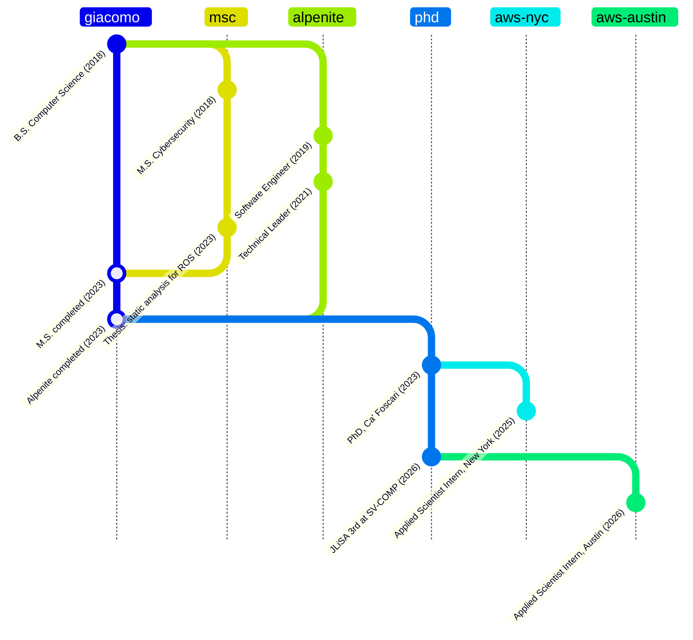

## Giacomo Zanatta

PhD candidate in Computer Science at Ca' Foscari University of Venice, working on
static analysis, formal verification, and the security of robotic software.

- Primary developer of [JLiSA](https://github.com/lisa-analyzer/jlisa), an abstract-interpretation
  analyzer for Java, ranked 3rd in the Java track at SV-COMP 2026
- Building a real-time network security firewall for ROS 2 that detects compromised nodes
- Two Applied Scientist internships at AWS (New York 2025, Austin 2026) on taint analysis and verification

### Career

### Selected publications

- *JLiSA: The Java Frontend of the Library for Static Analysis* (competition contribution), TACAS 2026
- *Inference of Access Policies through Static Analysis*, STTT 2025
- *Automating ROS 2 Security Policies Extraction through Static Analysis*, IROS 2024
- *Sound Static Analysis for Microservices: Utopia? A Preliminary Experience with LiSA*, FTfJP 2024

### Tools

- [fastapi-routing-check](https://github.com/giacomozanatta/fastapi-routing-check): finds routing defects in FastAPI applications via abstract interpretation
- [judi](https://github.com/giacomozanatta/judi): MCP server for JVM debugging
- [sros2-policy-clustering](https://github.com/giacomozanatta/sros2-policy-clustering): clusters SROS2 permission policies into security enclaves

[giacomozanatta.com](https://www.giacomozanatta.com) · [Publications](https://www.giacomozanatta.com/publications) · [LinkedIn](https://www.linkedin.com/in/giacomozanatta/)
